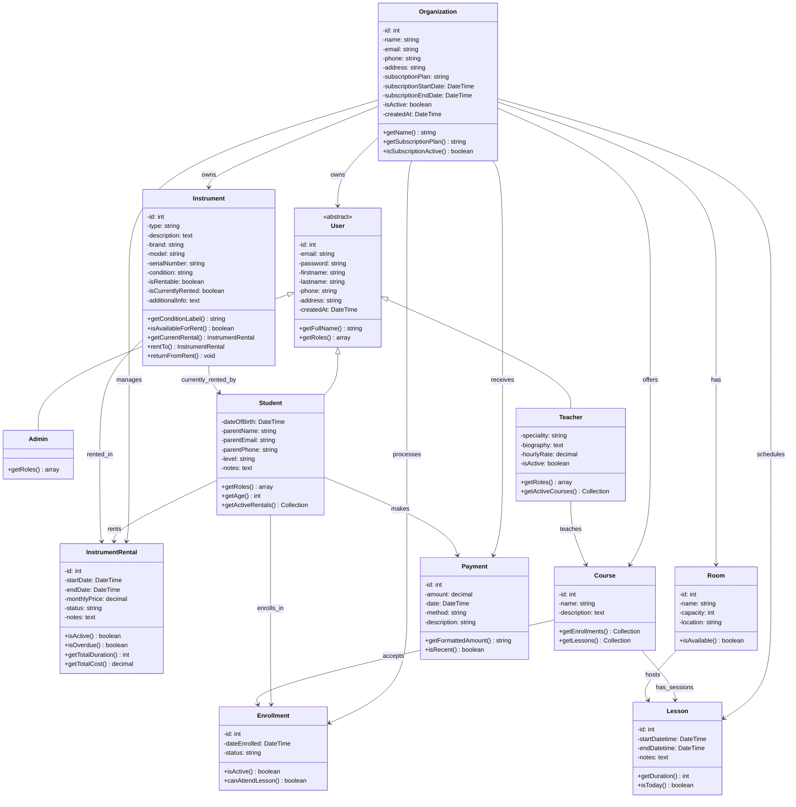

# Diagramme de Classes - App Musikeo

## Architecture Multi-tenant avec Gestion d'Inventaire d'Instruments

## Architecture Multi-tenant

L'application est conçue comme un **SaaS multi-tenant** où chaque **école de musique** (Organization) a sa propre isolation de données.

### Entités principales :

- **Organization** : École de musique avec abonnement
- **User** (abstract) : Utilisateurs avec héritage
  - **Admin** : Gestionnaire de l'école
  - **Teacher** : Professeurs de musique
  - **Student** : Élèves inscrits
- **Instrument** : Inventaire physique d'instruments
- **InstrumentRental** : Système de location/prêt
- **Course** : Cours proposés par l'école
- **Lesson** : Sessions de cours planifiées
- **Enrollment** : Inscriptions des étudiants
- **Payment** : Gestion des paiements

## Évolutions Récentes

### ✅ v2.0 - Transformation Inventaire (Nov 2025)
- **Restructuration complète** de l'entité `Instrument`
- Passage d'un **catalogue académique** à un **inventaire physique**
- Ajout du système de **location/prêt** avec `InstrumentRental`
- Support des **numéros de série**, **conditions**, **marques/modèles**

### ✅ v1.5 - Multi-tenant Architecture (Nov 2025)
- Ajout de l'entité `Organization` pour l'isolation des données
- **Architecture SaaS** complète par école de musique
- Plans d'abonnement (free, standard, premium, custom)
- Toutes les entités liées à une organisation

### ✅ v1.0 - Base Symfony (Oct 2025)
- Architecture utilisateur avec héritage (`Admin`, `Teacher`, `Student`)
- Système de cours, salles et planning
- Gestion des inscriptions et paiements
- Interface moderne avec Tailwind CSS

## Prochaines Évolutions Prévues

### 🔄 Dashboard Student
- Interface étudiante pour consulter cours et locations
- Historique des paiements et planning personnel

### 🔄 Interface de Gestion d'Inventaire
- CRUD complet pour les instruments
- Gestion des locations/retours
- Statistiques d'utilisation du matériel

### 🔄 Système de Notifications
- Alertes pour retours d'instruments en retard
- Notifications de paiements
- Rappels de cours