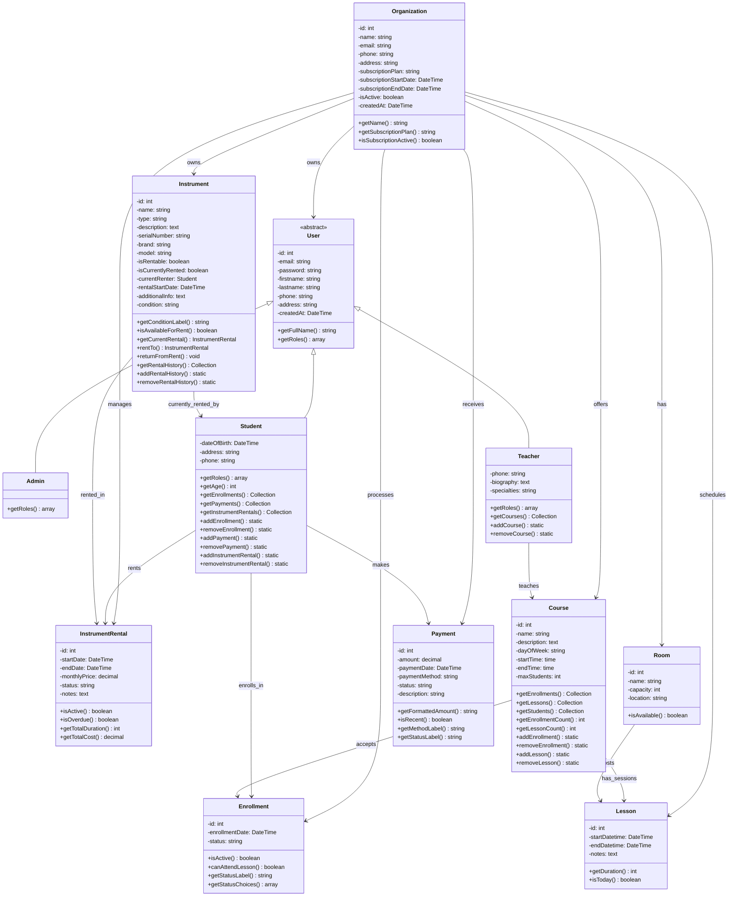

# Diagramme de Classes - App Musikeo

## Architecture Multi-tenant avec Gestion d'Inventaire d'Instruments

## Architecture Multi-tenant

L'application est conçue comme un **SaaS multi-tenant** où chaque **école de musique** (Organization) a sa propre isolation de données.

### Entités principales :

- **Organization** : École de musique avec abonnement
- **User** (abstract) : Utilisateurs avec héritage
  - **Admin** : Gestionnaire de l'école
  - **Teacher** : Professeurs de musique
  - **Student** : Élèves inscrits
- **Instrument** : Inventaire physique d'instruments
- **InstrumentRental** : Système de location/prêt
- **Course** : Cours proposés par l'école
- **Lesson** : Sessions de cours planifiées
- **Enrollment** : Inscriptions des étudiants
- **Payment** : Gestion des paiements

## Évolutions Récentes

### ✅ v2.2 - Système de Gestion des Élèves (Nov 2025)
- **Interface complète de gestion des élèves** avec CRUD complet
- **StudentController** : Sécurité admin et isolation par organisation
- **StudentType** : Formulaire avec validation complète (email, nom, prénom, date de naissance, téléphone, adresse)
- **Templates responsives** : Index avec grille, détail complet, formulaires de création/édition
- **Fonctionnalités avancées** :
  - Statistiques en temps réel (élèves, inscriptions actives, locations, paiements)
  - Système de recherche multi-champs (nom, prénom, email, téléphone)
  - Filtres par statut (inscriptions actives, locations actives, paiements récents)
  - Validation des contraintes avant suppression
- **Navigation hiérarchique** : Menu "Élèves" avec sous-menu "Préinscriptions"
- **Intégration complète** avec les cours, instruments et paiements

### ✅ v2.1 - Gestion Complète des Cours (Nov 2025)
- **Interface d'administration complète** pour la gestion des cours
- **CRUD complet** : Création, consultation, modification, suppression des cours
- **Système de recherche et filtres** par nom, professeur, description
- **Statistiques avancées** : nombre d'élèves, leçons programmées par cours
- **Validation des contraintes** : impossible de supprimer un cours avec inscriptions/leçons
- **Templates responsives** avec interface moderne TailwindCSS
- **Attribution flexible des professeurs** avec gestion des changements
- **Navigation intégrée** dans le menu administrateur

### ✅ v2.0 - Transformation Inventaire (Nov 2025)
- **Restructuration complète** de l'entité `Instrument`
- Passage d'un **catalogue académique** à un **inventaire physique**
- Ajout du système de **location/prêt** avec `InstrumentRental`
- Support des **numéros de série**, **conditions**, **marques/modèles**

### ✅ v1.5 - Multi-tenant Architecture (Nov 2025)
- Ajout de l'entité `Organization` pour l'isolation des données
- **Architecture SaaS** complète par école de musique
- Plans d'abonnement (free, standard, premium, custom)
- Toutes les entités liées à une organisation

### ✅ v1.0 - Base Symfony (Oct 2025)
- Architecture utilisateur avec héritage (`Admin`, `Teacher`, `Student`)
- Système de cours, salles et planning
- Gestion des inscriptions et paiements
- Interface moderne avec Tailwind CSS

## Prochaines Évolutions Prévues

### 🔄 Dashboard Student
- Interface étudiante pour consulter cours et locations
- Historique des paiements et planning personnel
- Gestion du profil étudiant

### 🔄 Gestion Avancée du Planning
- Interface de planification des leçons
- Calendrier intégré pour visualiser les cours
- Gestion des conflits d'horaires et salles

### 🔄 Interface de Gestion d'Inventaire Avancée
- Dashboard d'inventaire avec statistiques d'utilisation
- Gestion des retours d'instruments en retard
- Maintenance et réparations

### 🔄 Système de Notifications
- Alertes pour retours d'instruments en retard
- Notifications de paiements
- Rappels de cours
- Notifications par email/SMS

### 🔄 Gestion des Préinscriptions
- Système de préinscriptions en ligne
- Validation des demandes d'inscription
- Workflow d'admission des élèves